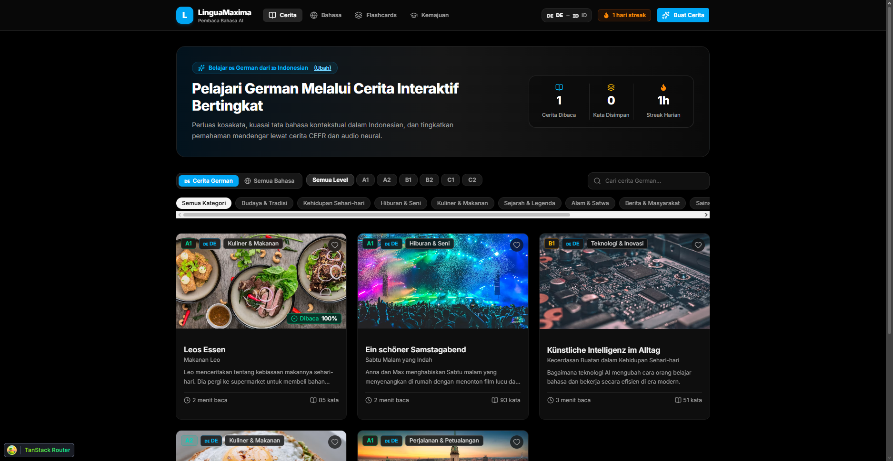
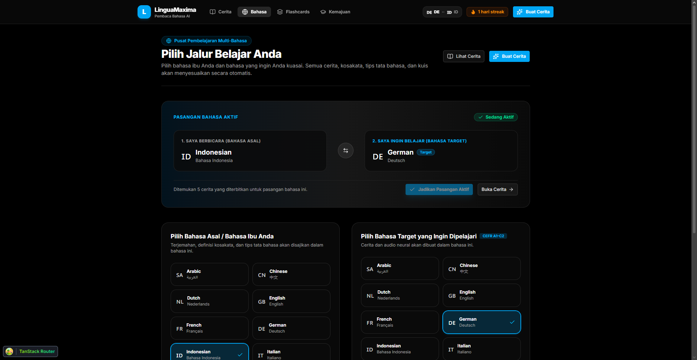

<div align="center">

# 🌍 LinguaMaxima

### AI-Powered Multi-Language Reader & Spaced Repetition Learning Platform

<p align="center">
  
  <br />
  <em>Interactive Story Library with Multi-Level Filtering, Progress Tracking, and Dynamic Language Pair Support</em>
</p>

<p align="center">
  
  <br />
  <em>Multi-Language Learning Center: Configure native origin and target learning paths</em>
</p>

---

[](https://www.typescriptlang.org/) [](https://react.dev/) [](https://tanstack.com/start) [](https://fastapi.tiangolo.com/) [](https://tailwindcss.com/) [](https://ui.shadcn.com/) [](https://github.com/oxc-project/oxc)

</div>

---

## 📖 Overview

**LinguaMaxima** is an AI-powered language acquisition platform inspired by the proven pedagogy of graded readers, engineered with modern AI generation pipelines to support **any arbitrary language pair** at zero marginal content cost.

Whether you are an Indonesian speaker learning German, an English speaker mastering Japanese, or a French speaker learning Spanish, LinguaMaxima produces level-graded stories (A1 Beginner to C2 Mastery) with native-tongue translations, contextual grammar explanations, comprehension quizzes, neural audio pronunciation, and an integrated SuperMemo SM-2 spaced repetition flashcard system.

---

## ✨ Key Features

- **📚 AI-Generated Graded Stories (A1 to C2)** Calibrated short stories across diverse topics (Travel, Culture, Food, Daily Life, Technology, Science, History, Nature) tailored across 6 progressive proficiency tiers from beginner basics to fluent mastery.
- **🔄 Universal Language Pair Engine** Learn any target language from any native language (e.g., German from Indonesian, Japanese from English, French from Spanish). All stories, definitions, grammar tips, and quizzes adapt symmetrically.
- **⚡ Interactive Tap-to-Translate & Parallel Reader** Tap any word in a story to open an instant breakdown with grammatical gender (`der`/`die`/`das`, `el`/`la`, `le`/`la`), part of speech, definition in your native tongue, and example sentences. Toggle full parallel bilingual translations at any time.
- **🧠 SuperMemo SM-2 Spaced Repetition Flashcards** Save new vocabulary directly from stories into your personal review deck. Review daily with the SM-2 algorithm (Again, Hard, Good, Easy) for long-term retention.
- **📝 Interactive Comprehension Quizzes** Test your reading comprehension with multiple-choice, fill-in-the-blank, article practice, and true/false quizzes with instant grading and explanations.
- **🎧 Neural Audio Pronunciation** Listen to authentic, native-speaker audio for every story with playback speed controls (0.75x, 1x, 1.25x), progress scrubbing, and quick 5-second rewind.
- **📊 Comprehensive Learning Dashboard & Streaks** Track read stories, learned vocabulary count, daily learning streaks, average quiz scores, and saved favorites.
- **🌐 100% Internationalization (i18n)** Complete interface localization across 7 languages: **English (`en`)**, **German (`de`)**, **Spanish (`es`)**, **French (`fr`)**, **Indonesian (`id`)**, **Japanese (`ja`)**, and **Chinese (`zh`)**.

---

## 🏗️ Architecture & Tech Stack

```
linguamaxima/
├── apps/
│   ├── web/                     # Full-stack React + TanStack Start SSR web application
│   └── api/                     # High-performance FastAPI Python backend
├── packages/
│   ├── ui/                      # Shared shadcn/ui primitives & Tailwind design tokens
│   ├── env/                     # Type-safe environment variable validation (T3 Env)
│   └── config/                  # Shared base TypeScript configurations
└── docs/                        # PRD, Architecture Design, and Research documentation
```

### Frontend (`apps/web`)

- **Framework**: [TanStack Start](https://tanstack.com/start) + [React 19](https://react.dev/)
- **Routing & Data Fetching**: [TanStack Router](https://tanstack.com/router) & [TanStack Query](https://tanstack.com/query)
- **Styling**: [Tailwind CSS v4](https://tailwindcss.com/) + `@linguamaxima/ui` (shadcn/ui + Base UI primitives)
- **Internationalization**: Custom typed i18n engine with full parameter interpolation and 7 localized dictionaries

### Backend (`apps/api`)

- **API Framework**: [FastAPI](https://fastapi.tiangolo.com/) (Python 3.12+)
- **Database & ORM**: [SQLAlchemy 2.0](https://www.sqlalchemy.org/) async with SQLite (or PostgreSQL) & [Alembic](https://alembic.sqlalchemy.org/) migrations
- **AI Story Pipeline**: LLM story generator (Google Gemini 2.5 Flash / LiteLLM)
- **Neural TTS Engine**: Edge-TTS integration for fast, authentic multi-language audio synthesis
- **Image Integration**: Automated royalty-free thematic story illustrations

---

## 🚀 Getting Started

### Prerequisites

- **Node.js** >= 20.x
- **pnpm** >= 9.x
- **Python** >= 3.12 (managed via `uv` or `venv`)

### 1. Clone the Repository

```bash
git clone https://github.com/puruhitaaa/linguamaxima.git
cd linguamaxima
```

### 2. Setup Frontend & Monorepo Dependencies

```bash
pnpm install
```

### 3. Setup Python Backend (`apps/api`)

```bash
cd apps/api

# Create virtual environment and install dependencies
uv venv
source .venv/bin/activate  # On Windows: .venv\Scripts\activate
uv pip install -e .

# Run database migrations and seed initial data
alembic upgrade head
python -m app.initial_data

cd ../..
```

### 4. Start Development Servers

To start both frontend and backend concurrently:

```bash
# Start frontend web app (http://localhost:3001)
pnpm run dev:web

# Start backend API (http://localhost:8000)
cd apps/api && uvicorn app.main:app --reload --port 8000
```

Open [http://localhost:3001](http://localhost:3001) in your browser.

---

## 🐳 Docker Deployment

You can build and run the entire stack with Docker Compose:

```bash
# Build Docker images
pnpm run docker:build

# Start containers
pnpm run docker:up

# View logs
pnpm run docker:logs

# Stop containers
pnpm run docker:down
```

---

## 🛠️ Code Quality & Formatting

This project enforces strict code quality and formatting via **Ultracite** (powered by Oxlint and Oxfmt):

```bash
# Run linting and formatting check
pnpm dlx ultracite check

# Automatically fix formatting and lint issues
pnpm dlx ultracite fix

# Check TypeScript types across all workspaces
pnpm run check-types
```

---

## 📜 Available Scripts

| Command | Description |
| --- | --- |
| `pnpm run dev` | Start development servers |
| `pnpm run dev:web` | Start the web application |
| `pnpm run build` | Build all packages and applications |
| `pnpm run check-types` | Type-check TypeScript across the monorepo |
| `pnpm dlx ultracite check` | Run Oxlint + Oxfmt linter and format verification |
| `pnpm dlx ultracite fix` | Auto-format and fix linting violations |
| `pnpm run docker:up` | Launch production containers with Docker Compose |

---

## 📄 License

This project is licensed under the MIT License.
